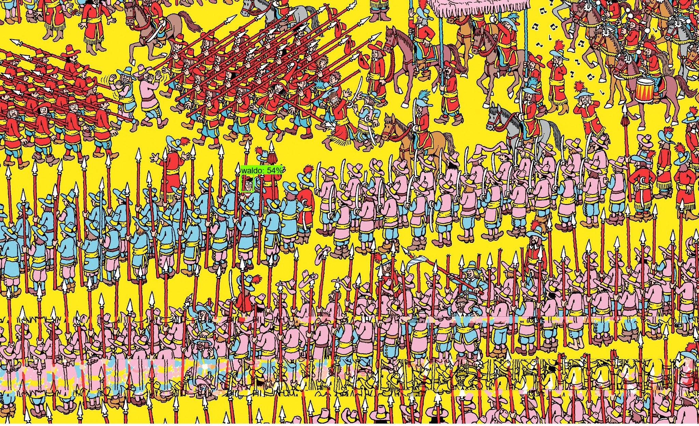

# FolloWaldo

A neural network trained to solve the classic game of Where's Waldo. Built using Tensorflow 2 Object Detection API. 

### Example input:

### Example output:

## Video Demo:
[Youtube](https://www.youtube.com/watch?v=IgCsOW-bpf4&fbclid=IwAR1MJE1jO_TuQV-PIkuAoPP7KWYFGvDLUTupg90skNPJ3S6tXjvoTEFATMA)

## Try it out for yourself!

### Website:
Built with Django. See it [here!](https://github.com/M4THYOU/waldo_backend)

### Terminal:
1. Model should be saved to [exported-models/my_model](exported-models/my_model)
2. Run [run_inference.py](run_inference.py) to perform inference
    * Use --help for configuration options
3. Images can be updated in [images/input](images/input) and are produced in [images/output](images/output)
